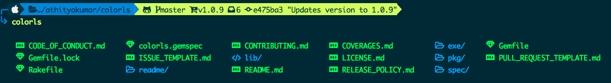

# MacOS Development setup

##### Table of Contents  
[Development software](#development-software)
[Development as Mobile/Web developer](#Development-as-mobile/web-developer)
[Environments for Mobile/Web developer](#environments-for-mobile/web-developer)  

## Development software

### Install iTerm2
- [iTerm2](https://iterm2.com/)

### Docker
- [Docker](https://www.docker.com)

### Homebrew
The Missing Package Manager for macOS (or Linux)
- [Homebrew](https://brew.sh/)

```bash
/bin/bash -c "$(curl -fsSL https://raw.githubusercontent.com/Homebrew/install/HEAD/install.sh)"

eval "$(/opt/homebrew/bin/brew shellenv)"

```
### Android Studio
- [Android studio](https://developer.android.com/studio)


### ZSH
Oh My Zsh is a framework for Zsh, the Z shell.

- [ZSH](https://www.zsh.org/)

> Latest versions of macOS already come with zsh as default shell. However, you can check if zsh is configured going to the native terminal settings general tab:


in case it is not installed

```bash
brew install zsh
```

Select zsh instead bash
```bash
zsh
```

#### Set ZSH as default 
- [How to set ZSH as default](https://www.codegrepper.com/code-examples/shell/set+the+default+shell+to+zsh+in+alacritty)


```bash
chsh -s /bin/zsh
```

### oh-my-zsh
- [oh-my-zsh](https://ohmyz.sh/)

```bash
sh -c "$(curl -fsSL https://raw.githubusercontent.com/ohmyzsh/ohmyzsh/master/tools/install.sh)"

```

### PowerLevel10k
- [PowerLevel10k](https://github.com/romkatv/powerlevel10k)

```bash
# git
git clone --depth=1 https://github.com/romkatv/powerlevel10k.git ${ZSH_CUSTOM:-$HOME/.oh-my-zsh/custom}/themes/powerlevel10k

# homebrew
brew install powerlevel10k
echo "source $(brew --prefix)/share/powerlevel10k/powerlevel10k.zsh-theme" >>~/.zshrc

```

Then you need to enable it, change the value of ZSH_THEME to following in `~/.zshrc` file :
```bash
ZSH_THEME="powerlevel10k/powerlevel10k"
```

### Configure Powerlevel10k Theme
Before make sure your terminal font is FiraCode NF.
- [FiraCode](https://github.com/ryanoasis/nerd-fonts/tree/master/patched-fonts/FiraCode)

Other option
- [Nerd Font](https://www.nerdfonts.com/font-downloads)

After installing the font
```bash
p10k configure
```

### ZSH Plugins
- [autosuggestions](https://github.com/zsh-users/zsh-autosuggestions) 
- [syntax-highlighting](https://github.com/zsh-users/zsh-syntax-highlighting)
- [completions](https://github.com/zsh-users/zsh-completions)

### Activate the plugins
In ~/.zshrc file replace the line starting with plugins=() to below line.

```bash
plugins=( git zsh-syntax-highlighting zsh-autosuggestions )

fpath+=${ZSH_CUSTOM:-${ZSH:-~/.oh-my-zsh}/custom}/plugins/zsh-completions/src
```

### ls tools
- [color](https://github.com/athityakumar/colorls?tab=readme-ov-file#installation)

Note for iTerm2 users - Please enable the Nerd Font at iTerm2 > Preferences > Profiles > Text > Non-ASCII font > Hack Regular Nerd Font Complete.



```bash
gem install colorls

```

#### for colors
Add to `~/.zshrc`

```bash
if [ -x "$(command -v colorls)" ]; then
    alias ls="colorls"
    alias la="colorls -al"
fi
```


### Iterm Templates

- [Iterm2colorschemes](https://iterm2colorschemes.com/)

Steps

- Navigate to Colors tab
- Click on Load Presets
- Click on Import
- Select the .itermcolors file(s) of the scheme(s) you'd like to use
- Click on Load Presets and choose a color scheme


## Development as Mobile/Web developer

### Install NVM 
Alternative to NVM (Node Version Manager) 
- [NVM](https://github.com/nvm-sh/nvm?tab=readme-ov-file#installing-and-updating)

```bash
curl -o- https://raw.githubusercontent.com/nvm-sh/nvm/v0.40.0/install.sh | bash

curl -o- https://raw.githubusercontent.com/nvm-sh/nvm/v0.40.0/install.sh | bash

```

### Install Volta 
Alternative to NVM (Node Version Manager) 
- [Volta](https://volta.sh/)

```bash
# install Volta
curl https://get.volta.sh | bash

# install Node
volta install node

# start using Node
node
```

### angular
- [angular](https://angular.io/cli)
```bash
    npm install -g @angular/cli
 ```

### typescript
- [typescript](https://www.typescriptlang.org/docs)

```bash
    #Dev
    npm install typescript --save-dev
    #Global
    npm install typescript -g
    #compile
    npx tsc
```
### ionic
- [ionic](https://ionicframework.com/)

```
npm i -g @ionic/cli
```

### gulp
- [gulp](https://gulpjs.com/docs/en/getting-started/quick-start/)

```
npm install --global gulp-cli
npm install --save-dev gulp
```

### Nestjs
<https://nestjs.com/>
```
npm i -g @nestjs/cli
nest new project-name
```

### Set JDK, maven, gradle and JRE - SDKMNAN
- [SDK MANAGER](https://sdkman.io/install)
```bash
    sdk install java 23.ea.17-open
    sdk install maven
    sdk install gradle
```
    

## Environments for Mobile/Web developer
- [android environments](https://developer.android.com/tools/variables)

```bash
#ANDROID
export ANDROID_SDK_ROOT=$HOME/Library/Android/sdk
export ANDROID_HOME=$ANDROID_SDK_ROOT
#adb, logcat
export PLATFORM_TOOLS=$ANDROID_SDK_ROOT/platform-tools
#avdmanager, sdkmanager
export ANDROID_TOOLS=$ANDROID_SDK_ROOT/cmdline-tools/latest/bin
export BUILD=$ANDROID_SDK_ROOT/build-tools/29.0.0
#emulator
export EMULATOR=$ANDROID_SDK_ROOT/emulator

export PATH=$PLATFORM_TOOLS:$ANDROID_TOOLS:$BUILD:$EMULATOR:/opt/homebrew/bin:/usr/local/bin:/System/Cryptexes/App/usr/bin:/usr/bin:/bin:/usr/sbin:/sbin:/var/run/com.apple.security.cryptexd/codex.system/bootstrap/usr/local/bin:/var/run/com.apple.security.cryptexd/codex.system/bootstrap/usr/bin:/var/run/com.apple.security.cryptexd/codex.system/bootstrap/usr/appleinternal/bin:/Applications/iTerm.app/Contents/Resources/utilities


```

### Generate SSH key and connect Github
```
 ssh-keygen -t rsa -b 4096 -C "feldjesus@gmail.com"

 git config user.email feldjesus@gmail.com
 git config user.name 'Felipe Ramirez'

```

### Note: if is needed
Add this line to configure lang
```bash
export LANG=en_US.UTF-8
```

Add this line to configure java version (if you have 2)
```bash
export JAVA_HOME=$(/usr/libexec/java_home -v 1.8.0_401)
```


Add this line to configure nvm, rossetta, and sdk manager
```bash
export NVM_DIR="$HOME/.nvm"
[ -s "/opt/homebrew/opt/nvm/nvm.sh" ] && \. "/opt/homebrew/opt/nvm/nvm.sh"  # This loads nvm
[ -s "/opt/homebrew/opt/nvm/etc/bash_completion.d/nvm" ] && \. "/opt/homebrew/opt/nvm/etc/bash_completion.d/nvm"  # This loads nvm bash_completion


 # Intel Platform (rossetta)
alias intel="arch -x86_64"

#THIS MUST BE AT THE END OF THE FILE FOR SDKMAN TO WORK!!!
export SDKMAN_DIR="$HOME/.sdkman"
[[ -s "$HOME/.sdkman/bin/sdkman-init.sh" ]] && source "$HOME/.sdkman/bin/sdkman-init.sh"

```

### After all these steps type
```bash
source ~/.zshrc
```